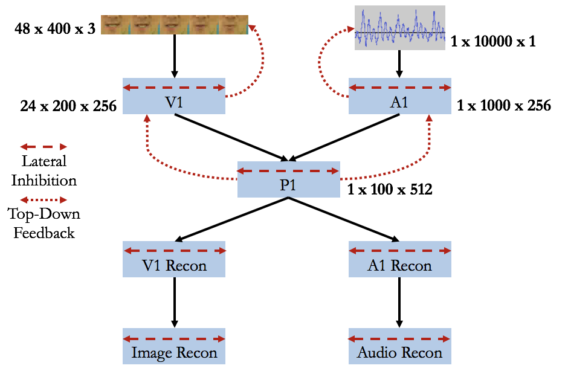

# Learning the McGurk Effect from Raw Input

Darryl Hannan

Villanova University

## Abstract
The McGurk effect is a cognitive phenomenon that occurs when individuals attempt to interpret a mismatched phoneme/viseme pair, resulting in the perception of a third sound. This effect is a clear example of multimodal processing in the human brain. Here, I attempt to create a multimodal convolutional neural network that learns a joint embedding space such that the trained model exhibits the McGurk effect. The model was unable to produce the effect due to the nature of the embedding space. However, the results have provided me with some insights regarding potential modifications that can be made to the model.

## Introduction
Humans are really good at multimodal processing. Every moment, we are bombarded with a profusion of information from multiple modalities, and manage to assemble it into a unified coherent experience. Machines, on the other hand, can only perform basic multimodal tasks, such as image captioning and visual question answering. Here, I apply multimodal machine learning techniques to auditory and visual information.

The smallest units of language are known as phonemes. Examples of phonemes include the /th/ sound in "the" and the /k/ sound in "cat". English is composed of 44 phonemes, despite having only 26 letters. A viseme is the lip movement associated with a phoneme. This relationship is not one-to-one, with some phonemes sharing visemes. When people are actively engaged in conversation, their interpretation of what the other person is saying is not solely based upon auditory information. So long as they are looking at the person who is speaking, they also rely upon visual information in the form of visemes.

This relationship is demonstrated by the McGurk effect. The McGurk effect occurs when the phoneme and viseme do not match. Each modality indicates a different sound to the brain. Unsure how to handle this conflicting information, the brain tends to combine the two sounds. This can result in the perception of a third sound that wasn't expressed in either modality. The classic example of this occurs when the phoneme is /b/a and the viseme is /g/a; many individuals report hearing /d/a.

Here, I construct a convolutional autoencoder that learns the relationship between phonemes and visemes. The model merges each modality into a joint embedding space, and then attempts to reconstruct the inputs. The goal of the project is to learn a joint embedding space that is robust enough for the trained model to exhibit the McGurk effect.

## Related Work
This is not the first attempt at using machine learning to model the McGurk effect. Sporea and Gruning (2010) use an artificial neural network to model the effect. This model was created prior to the popularization of convolutional networks. They extract cues from the data, such as mouth width and height, and use these features as input. They also treat the problem as a classification task, where classes are phonemes.

A more recent work, by Getz et al. (2017), uses gaussian mixture models (GMMs) to learn the effect. They use their model to simulate the developmental process that humans go through to learn phonological categories. The inputs to this model also take the form of extracted cues.

Other models attempt to learn the relationship between auditory and visual information, but do not model the McGurk effect. Current state of the art is seen in the work of Torfi et al. (2017). They use a 3D convolutional autoencoder to handle both the spatial and temporal natures of the visual information. Features are extracted from the auditory information and fed into the model as vectors.

A major component of my model is that it uses raw input. The visual modality is represented using video frames and the audio modality is represented using a raw waveform. This complicates things for the model, requiring it to extract both spatial and temporal information, but it limits preprocessing and allows the model to determine which cues to extract.

## Methodolgy
### The Data
The data is obtained from the GRID audio-visual sentence corpus. This dataset consists of videos of 34 individuals reading sentences 1000 sentences aloud. Every sentence that is read, for each speaker, has a separate video. Therefore, there are approximately 34000 videos in the dataset.

Each video's frames are extracted as images. The videos are 3 seconds long at 25 frames per second, leading to 75 images per video. The frames contain the individual's entire head and most of their upper torso. All of the visual information that we need is produced by the mouth, so scripts are used to crop it out of each image. From here, sets of five images are concatenated together horizontally, representing 200 milliseconds of video. Lastly, the image is converted into greyscale. The final size of the image is 400x48.

*Example  of data pair*

Scripts are used to separate the audio from each video, and convert it into raw wave format. The audio is sampled at 8192 kHz. The files are then segmented into 200 millisecond chunks, in order to be paired with the images. The waveform is fed into the model as a vector of size 10,000x1.

The final dataset consisted of over 400,000 data pairs. It would take too much time to train the model on the entire set, so 10,000 pairs are sampled and split into training/testing sets.

### The Model
The model is a multimodal convolutional autoencoder. 2D convolutions are used for the images, capturing both spatial and temporal features. 1D convolutions, with a large filter size, are used for the waveform. The joint embedding is created by convolving each modality down to the same size, then performing element-wise addition. The resulting embedding is then deconvolved back into an image and waveform. The model is entirely unsupervised.

The model is constructed using [Keras](http://keras.io). Each layer uses a ReLU as its activation function, the loss function is the mean squared error of the reconstructions, and the optimizer is ADADELTA.

*Standard Convolution Autoencoder*

## Results
### Reconstruction
The model was able to reconstruct both modalities well. Some detail is lost in the reconstruction, such as teeth. However, the mouth shape is preserved nicely, which is the primary feature of interest. The audio reconstructs slightly muffled, but still identifiable.

*Sample Reconstuction: Original on top and Recon on bottom*

### McGurk Effect
After training, the model is fed the classic mismatched phoneme/viseme pair, /b/a and /g/a. This pair is commonly used due to the exaggerated nature of the lip movements. At this point, the image reconstruction is ignored because it has no implications for the McGurk effect. The audio reconstruction is manually evaluated to see which phoneme it most resembles. Upon evaluation, it was found that the resulting audio reconstruction did not produce an identifiable phoneme. Rather than producing a third sound, the conflicting modalities resulted in incoherent gibberish.

Since the model reconstructs well, the absence of the McGurk effect is most likely due to the nature of the joint embedding layer. The model must not only learn to reconstruct well, but also to align both modalities. Using the same neurons to represent common audio-visual features is the optimal way of representing data pairs in the joint layer, but finding this commonality is a difficult task. Only 35.75\% of the neurons in the joint embedding layer were active for both modalities.

*Average activity for each shared neuron in joint embedding layer*

In order for the model to learn shared neurons, the activations of the joint layer should be sparse. If too many neurons are being used to represent the two modalities, the model will simply learn to segment the embedding layer; part of the layer will be used to reconstruct the image and part will be used to reconstruct the waveform, without any shared neurons. The best way to encourage sparsity is to add normalization, such as an L1 norm, to the loss function. I attempted to add normalization to the model, but the audio reconstruction quality suffered greatly. As it stands, the model is on average 54.73\% sparse in the joint embedding layer.

*Percentage of active neurons in the joint layer for each test data pair*

## Future Work
Based upon the lack of sparsity, the model used by Kim et al. (2017) is perhaps better suited for learning the McGurk effect. A variation of this model for my task can be seen below. For starters, this model frames reconstruction as a hierarchical sparse coding problem. A1 sparse codes the waveform, V1 sparse codes the image, and P1 sparse codes A1 and V1. This forces the model to minimize the number of active neurons and encourages the creation of shared neurons. The model implements forms of lateral inhibition and top-down feedback. Lateral inhibition further encourages sparsity; when one neuron fires similar neurons in the layer are inhibited. Top-down feedback reinforces the interaction between the two modalities. If P1 determines that the phoneme is /d/a, it will nudge V1 and A1 into agreement. Instead of the image embedding and audio embedding competing with one another and confusing the joint layer, P1, A1, and V1 will determine the phoneme together.

*Modified convolutional autoencoder*

## Conclusion
Although the model was unable to produce the McGurk effect, it led to some critical insights that suggested the model used by Kim et al. (2017) might overcome its deficiencies. This new model contains biologically inspired modifications, in the form of top-down feedback and lateral inhibition. Given the model's ability to learn specialized "Halle Berry neurons", in this context it may be able to learn specialized neurons for common phonemes. If this is indeed the case, when each modality activates the specialized neuron for its corresponding phoneme, the resulting audio reconstruction should contain the sound of both phonemes.

## References
* H.McGurk and J.MacDonald, “HearingLipsandSeeingVoices, ”Nature Publishing Group, vol. 264, pp. 746–748, 1976. [Online]. Available: http://usd-apps.usd.edu/coglab/schieber/psyc707/pdf/McGurk1976.pdf

* I. Sporea and A. Gruning, “Modelling the McGurk effect,” European Symposium on Artificial Neural Networks, 2010. [Online]. Available: https://www.elen.ucl.ac.be/Proceedings/esann/esannpdf/es2010-61.pdf

* L. M. Getz, E. R. Nordeen, S. C. Vrabic, and J. C. Toscano, “Modeling the development of audiovisual cue integration in speech perception,” Brain Sciences, vol. 7, no. 3, 2017.

* A. Torfi, S. Mehdi Iranmanesh, N. Nasrabadi, and J. Dawson, “3D Convolutional Neural Networks for Cross Audio-Visual Matching Recognition,” IEEE Access, vol. 5, 2017. [Online]. Available: https://arxiv.org/pdf/1706.05739.pdf

* M. Cooke, J. Barker, S. Cunningham, and X. Shao, “An audio-visual corpus for speech perception and automatic speech recognition,” The Journal of the Acoustical Society of America, vol. 20,
no. 5, 2006. [Online]. Available: http://laslab.org/upload/an_audio-visual_corpus_for_speech_perception_and_automatic_speech_recognition.pdf

* V. Nair and G. E. Hinton, “Rectified Linear Units Improve
Restricted Boltzmann Machines,” Proc. 27th International
Conference on Machine Learning, 2010. [Online]. Available: http://citeseerx.ist.psu.edu/viewdoc/download?doi=10.1.1.165.6419&rep=rep1&type=pdf

* M. D. Zeiler, “ADADELTA: An Adaptive Learning Rate Method,” CoRR, dec 2012. [Online]. Available: http://arxiv.org/abs/1212.5701

* E. Kim, D. Hannan, and G. Kenyon, “Deep Sparse Coding for Invariant
Multimodal Halle Berry Neurons,” nov 2017. [Online]. Available: https://arxiv.org/abs/1711.07998
